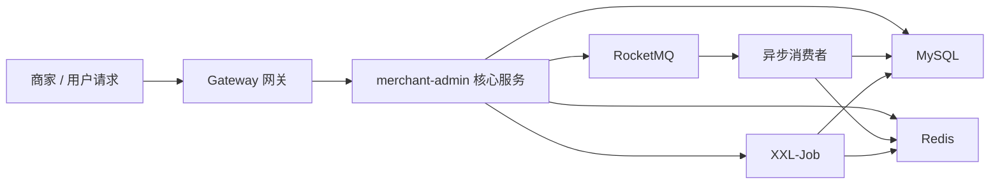

# 智慧券商家服务平台

智慧券商家服务平台是一个面向商家侧优惠券营销场景的 Java 后端项目复盘仓库，核心围绕优惠券模板管理、秒杀领券、预约提醒、批量发券、业务日志、安全鉴权和定时任务兜底展开。

本仓库用于秋招项目展示与技术复盘，不包含付费课程项目的完整源码。公开内容主要包括项目背景、架构设计、核心链路、技术取舍、面试表达和后续压测计划。

## 版权与公开范围说明

完整代码基于付费课程项目进行学习、复现、二次开发和功能扩展。出于版权合规考虑，本仓库不公开原始课程源码和完整业务代码。

本仓库公开内容包括：

- 项目整体介绍与技术栈说明
- 可运行的 Vue 3 商家端演示前端（`merchant-frontend/`）
- 商家后台核心业务闭环
- 秒杀领券、批量发券、预约提醒等核心链路设计
- Redis、RocketMQ、XXL-Job、bizlog-sdk 等技术方案复盘
- 面试介绍口径和追问准备
- 压测与验证计划

本仓库不公开内容包括：

- 付费课程原始源码
- 完整数据库建表脚本
- 本地运行配置、账号密码、密钥等敏感信息
- 可直接还原课程项目的完整实现细节

## 项目定位

项目定位为“优惠券商家服务平台核心模块”，不是完整商业化 SaaS 系统。当前主线聚焦商家后台核心能力：

- 商家创建优惠券模板，维护库存、有效期和领取规则。
- 用户可预约优惠券开抢提醒。
- 高并发场景下支持秒杀领券，解决库存超发、重复领取和重复提交问题。
- 商家可上传 Excel 用户列表进行批量发券。
- 系统通过 RocketMQ 异步解耦，通过 XXL-Job 做定时补偿。
- 通过 bizlog-sdk 记录核心业务操作日志，提升问题排查和审计能力。

## 技术栈

| 类型 | 技术 |
| --- | --- |
| 后端框架 | Java 17、Spring Boot 3、Spring MVC |
| 持久层 | MySQL、MyBatis-Flex、HikariCP |
| 缓存与并发 | Redis、Redisson、Lua Script、Bloom Filter |
| 消息队列 | RocketMQ |
| 定时任务 | XXL-Job |
| 鉴权与安全 | Sa-Token、RBAC、商户数据隔离 |
| 工程化 | Maven、MapStruct、EasyExcel、bizlog-sdk |
| 前端演示 | Vue 3、Vite、lucide-vue-next |
| 扩展方案 | ShardingSphere 分库分表方案预留 |

## 配套前端演示台

仓库新增 `merchant-frontend/`，用于本地联调和面试现场展示。它不是完整商业 SaaS 前端，而是围绕商家服务后台核心链路做的可运行演示台：

- 独立登录页，支持账号登录或粘贴 Apifox Token 后进入后台。
- 模板管理：创建、查询、增发、结束优惠券模板。
- 领券兑换：同步领取、异步兑换、兑换结果查询。
- 结算中心：查询可用/不可用优惠券、计算优惠金额、锁定、取消、核销、退款。
- 预约与批量：保留预约提醒和批量发券任务入口。
- 压测摘要：展示本地 JMeter 压测指标，方便面试讲解。

本地启动：

```bash
cd merchant-frontend
npm install
npm run dev
```

默认访问 `http://localhost:5173`，前端通过 Vite 代理将 `/api` 转发到本地 `http://localhost:10010` 后端。

## 核心亮点

### 高并发秒杀

基于 Redis Hash 缓存模板库存、状态和有效期等热点字段，通过 Redis Lua 脚本实现库存原子预扣和用户领取次数记录，结合布隆过滤器过滤非法模板 ID，并通过 Redisson 防止接口重复提交。

### 消息异步解耦

秒杀领券提交后，通过 RocketMQ 异步完成数据库扣减、用户券写入和结果状态回查。批量发券场景下，上传 Excel 后先创建任务，再由 MQ 消费端异步处理，避免接口同步阻塞。

### 预约提醒

通过 Bitmap 压缩存储用户的提醒类型和提醒时间，支持同一用户多种提醒方式合并记录，并结合 RocketMQ 延迟消息实现优惠券开抢提醒。

### 一致性兜底

使用 Cache Aside 思路处理 Redis 与 MySQL 的缓存一致性问题，并通过 XXL-Job 针对删缓存失败、服务异常、网络抖动等场景进行库存同步和状态补偿。

### 工程化设计

通过责任链拆分业务校验逻辑，通过自定义注解 + AOP 抽象防重复提交与 MQ 消费幂等能力，并引入 bizlog-sdk 沉淀核心业务操作日志。

## 架构概览



更详细的架构说明见 [docs/architecture.md](docs/architecture.md)。

## 核心链路

- 秒杀领券链路：[docs/core-flows.md](docs/core-flows.md)
- 接口与业务闭环：[docs/api-overview.md](docs/api-overview.md)
- 面试介绍与追问：[docs/interview-notes.md](docs/interview-notes.md)
- 压测与验证计划：[docs/performance-plan.md](docs/performance-plan.md)

## 本地验证情况

完整项目在本地已完成基础构建与测试验证：

```text
./mvnw.cmd -DskipTests compile 通过
./mvnw.cmd test 通过
```

说明：由于本仓库不公开完整源码，上述验证结果用于说明个人本地项目复盘进度，不代表本仓库可以直接运行完整服务。

## 面试说明口径

如果面试官问为什么仓库没有完整源码，可以这样说明：

> 完整代码基于付费课程项目做了学习、复现和二次开发，出于版权原因没有公开完整源码。这个仓库主要展示我的项目理解、核心链路设计、技术取舍和复盘文档。如果需要，我可以现场讲解秒杀领券、批量发券、缓存一致性和业务日志等核心实现。

## 后续计划

- 补充 JMeter 或 wrk 压测报告，区分设计目标和真实压测结果。
- 整理接口调用截图和核心链路时序图。
- 补充更多异常场景复盘，例如 MQ 重试、缓存回滚、库存不一致补偿。
- 持续完善 Java 后端面试追问文档。
