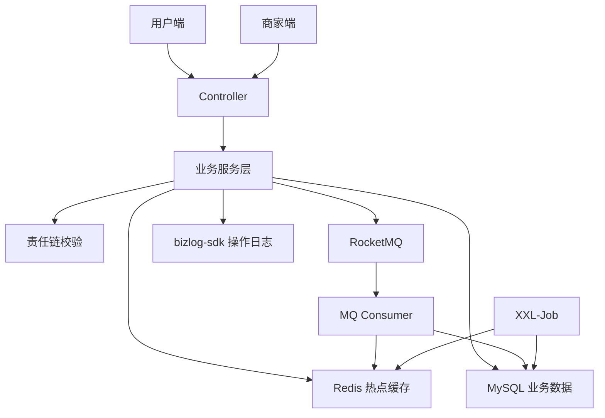

# 架构设计

## 整体目标

智慧券商家服务平台的核心目标是支撑商家侧优惠券营销场景，围绕“模板创建、预约提醒、秒杀领券、批量发券、核销和定时兜底”形成一条可讲清楚、可演示、可追问的后端项目主线。

项目不是完整生产级 SaaS，而是聚焦优惠券平台商家后台核心模块。

## 模块划分

| 模块 | 职责 |
| --- | --- |
| Gateway | 统一入口、路由转发、后续可扩展统一鉴权 |
| merchant-admin | 商家后台核心模块，承载模板、领券、提醒、批量发券、核销、日志和定时任务 |
| framework | 通用基础能力沉淀 |
| distribution | 分发域服务骨架 |
| engine | 领券引擎域服务骨架 |
| settlement | 核销结算域服务骨架 |
| search | 搜索域服务骨架 |

面试时建议主讲 `merchant-admin`，其他模块作为微服务拆分和后续演进方向说明即可。

## 核心组件关系

## 技术取舍

### 为什么 Redis + Lua

秒杀场景下，单纯依赖数据库扣库存会让数据库承受较大压力。Redis 适合承载热点库存与领取记录，Lua 脚本可以保证“校验库存、扣减库存、记录领取次数”在 Redis 内部原子执行，降低并发下超发和重复领取风险。

### 为什么 RocketMQ

秒杀领券和批量发券都有“请求入口轻量化、后续处理异步化”的特点。RocketMQ 用于削峰、解耦和失败重试，避免接口同步等待复杂逻辑执行完成。

### 为什么 XXL-Job

MQ 更适合事件驱动，XXL-Job 更适合周期性兜底。项目中使用 XXL-Job 做优惠券定时上架、过期处理和库存同步补偿，解决异常场景下的数据最终一致性问题。

### 为什么 bizlog-sdk

普通日志偏技术排查，业务日志偏业务审计。优惠券模板创建、库存追加、秒杀领券、批量发券、核销等操作都需要沉淀可追踪记录，便于后续定位问题和复盘操作链路。

## 分库分表边界

ShardingSphere 当前作为方案预留，不作为主链路默认启用。原因是面试演示和本地复盘阶段更需要稳定闭环，过早引入分库分表会增加调试、事务、联表查询和环境部署复杂度。

推荐表达：

> 我在项目中保留了 ShardingSphere 分库分表设计方案，采用模板 ID 与用户 ID 的复合分片思路，主要面向后续海量用户券数据扩展。当前主版本优先保证模板、领券、预约和批量发券核心链路稳定。
