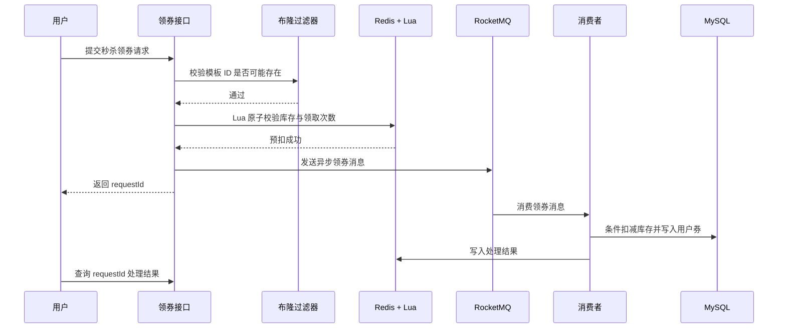
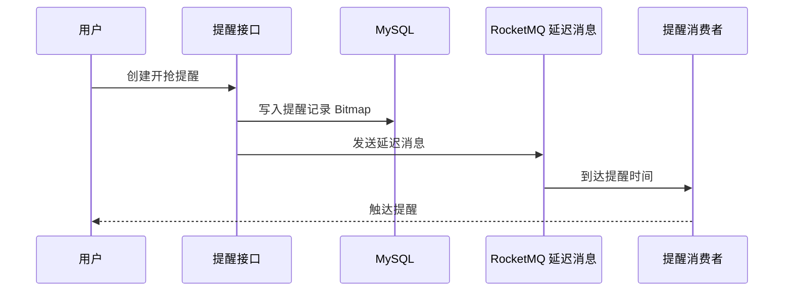
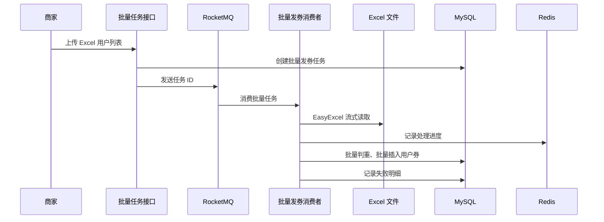

# 核心业务链路

## 秒杀领券链路

### 解决的问题

- 高并发请求直接打数据库会造成库存扣减压力。
- 用户重复点击可能导致重复领取。
- 接口同步完成数据库写入会增加响应时间。

### 设计要点

- 使用布隆过滤器过滤明显不存在的模板 ID，降低缓存穿透和无效请求压力。
- 使用 Redis Hash 缓存模板库存、状态、有效期等热点字段。
- 使用 Lua 脚本原子完成库存预扣和用户领取次数记录。
- 使用 RocketMQ 异步落库，接口优先返回请求 ID。
- 消费端完成数据库条件扣减、用户券写入、缓存更新和结果回写。

## 预约提醒链路

### 设计要点

- 使用一个 `Long information` 记录提醒类型与提醒时间。
- 通过位运算判断是否已经预约、取消指定提醒位。
- RocketMQ 延迟消息负责到点触发提醒，避免定时任务频繁扫描。

## 批量发券链路

### 设计要点

- 上传接口只负责保存文件和创建任务，避免长时间同步阻塞。
- EasyExcel 流式读取大文件，降低内存压力。
- 以批次为单位处理用户列表，结合 Redis 记录处理进度。
- 对失败用户记录失败原因，为后续重试预留能力。

## 一致性兜底链路

### 设计要点

- MySQL 作为最终可信数据源。
- Redis 承载高频读取与秒杀热点数据。
- Cache Aside 处理普通缓存读写。
- XXL-Job 定时对异常场景进行补偿，例如库存同步、自动上架、过期失效。
